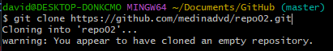
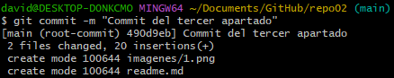

# Git & Markdown

## Ejercicio 2

***

### **2.1**

El directorio creado en GitHub es remoto porque no se ha creado o copiado en
local.

### **2.2**

Clonamos el directorio remoto en local mediante el comando "git clone (URL del direcotio en GitHub)".

### **2.3**

Realizamos el "git add ." para añadir los ficheros al stagin area. Posteriormente
realizamos el commit.

### **2.4**

***Comandos en Git***

|Comandos |Uso |
|:--- | :---|
|$ **git init "nombre de directorio"** |Inicializmos el directorio en git y lo convertimos en un working directory |
|$ **git remote add origin "URL del directorio en Github"** |Asociamos el repositorio remoto con el repositorio local |
|$ **git clone "URL del directorio en GitHub"** |Clonamos un directorio remoto de GitHub en uno local |
|$ **git status** |Devuelve la situacion actual de nuestra area de trabajo|
|$ **git add** |Añade uno o varios ficheros al stagin area |
|$ **git commit** |Enviamos los ficheros al repositorio local |
|$ **git log** |Devuelve un histoial de los commits realizados |
|$ **git commit** |Subimos los cambios realizados al repositorio remoto |
|$ **git branch -M "nombre rama"** |Nos permite cambiar el nombre de la rama |
|$ **git push "nombre del directorio"** |Actualizamos los cambios realizados en el directorio local para que se reflejen en el remoto |
